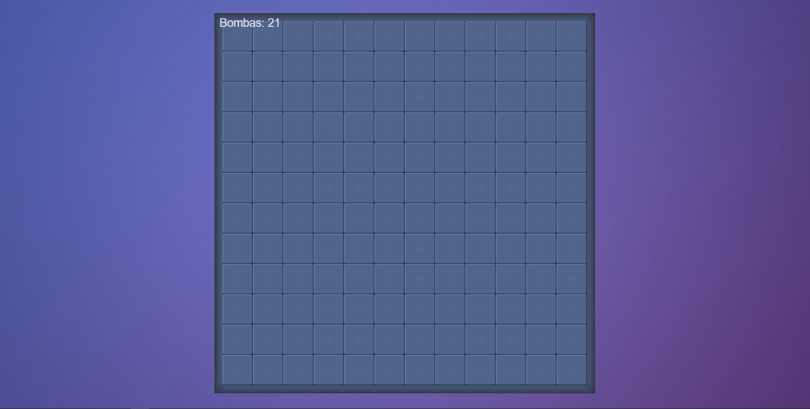
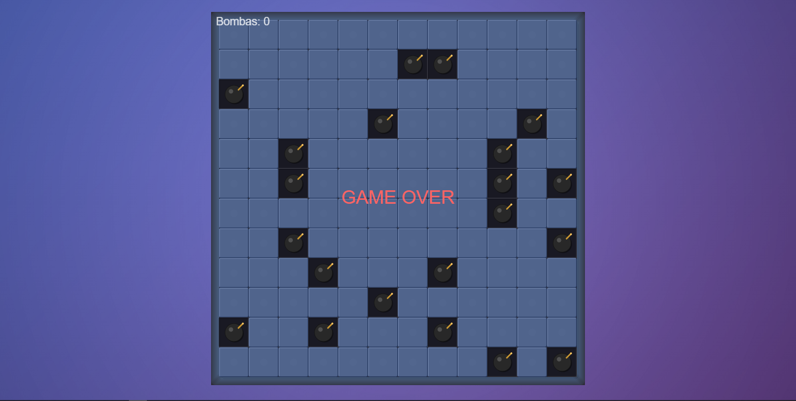

# 💣 Campo Minado | Game Fire

<div align="center">



**Uma reimaginação moderna e responsiva do clássico Campo Minado**

[](https://gameminado.netlify.app/)
[](https://github.com/luciomotta/CampoMinado)

</div>

---

## 🎯 **Sobre o Projeto**

Game Fire: Campo Minado é uma versão completamente modernizada do clássico jogo de Campo Minado. Desenvolvido com tecnologias web modernas, oferece uma experiência visual impressionante e totalmente responsiva para todos os dispositivos.

### ✨ **Principais Características**

🎨 **Design Moderno & Responsivo**
- Interface com gradientes suaves e efeitos 3D
- Adaptação automática para celular, tablet e desktop
- Animações fluidas e efeitos visuais avançados

📱 **Compatibilidade Total**
- Suporte completo a dispositivos touch
- Orientação automática (portrait/landscape)
- PWA ready - pode ser instalado como app

🎮 **Jogabilidade Aprimorada**
- Células com efeitos hover interativos
- Bombas realistas com animações
- Sistema de vitória/derrota inteligente
- Vídeo de explosão cinematográfico

⚡ **Performance Otimizada**
- Canvas dinâmico que se adapta à tela
- Preload de recursos para fluidez
- Código otimizado para dispositivos móveis

---

## 🚀 **Demonstração**

### **Interface Moderna do Jogo**

<div align="center">


**🖥️ Versão Desktop - Design Moderno com Gradientes**

</div>

<br>

### **Gameplay em Ação**

<div align="center">



**📱 Versão Mobile - Totalmente Responsivo**

</div>

---

## 🛠️ **Tecnologias Utilizadas**

<div align="center">

| Frontend | Design | Performance |
|----------|--------|-------------|
|  |  |  |
|  |  |  |

</div>

### **Biblioteca Principal**
- **[P5.js](https://p5js.org/)** - Para gráficos interativos e animações
- **[P5.sound](https://p5js.org/reference/#/libraries/p5.sound)** - Para efeitos sonoros (futuro)

---

## 🎮 **Como Jogar**

### **Objetivo**
Revelar todas as células do tabuleiro sem clicar em nenhuma bomba!

### **Controles**
- **🖱️ Clique/Touch**: Revela uma célula
- **📱 Mobile**: Totalmente otimizado para touch

### **Dicas de Jogo**
1. **Números** indicam quantas bombas estão nas células adjacentes
2. **Células vazias** abrem automaticamente as adjacentes
3. **Estratégia** é fundamental - use a lógica!

### **Sistema de Cores dos Números**
- 🔵 **1** - Azul
- 🟢 **2** - Verde  
- 🔴 **3** - Vermelho
- 🟣 **4** - Magenta
- 🟠 **5** - Laranja
- 🔵 **6** - Ciano
- 🟣 **7** - Roxo
- 🟡 **8** - Amarelo

---

## 💻 **Instalação Local**

### **Pré-requisitos**
- Navegador web moderno
- Servidor local (opcional)

### **Passos de Instalação**

```bash
# 1. Clone o repositório
git clone https://github.com/luciomotta/CampoMinado.git

# 2. Entre no diretório
cd CampoMinado

# 3. Abra o arquivo Index.html em seu navegador
# Ou use um servidor local:

# Opção 1: Python
python -m http.server 8000

# Opção 2: Node.js (live-server)
npx live-server

# Opção 3: VS Code - Live Server Extension
# Clique com botão direito em Index.html > "Open with Live Server"
```

### **Estrutura Simples**
```
📁 Baixe o projeto
📄 Abra Index.html
🎮 Comece a jogar!
```

---

## 📱 **Responsividade**

### **Breakpoints**
- **📱 Mobile**: < 480px - Interface compacta
- **📱 Tablet**: 481px - 768px - Tamanho médio
- **💻 Desktop**: > 768px - Interface completa

### **Orientações Suportadas**
- ✅ Portrait (Retrato)
- ✅ Landscape (Paisagem)
- ✅ Rotação automática

---

## 🎨 **Design System**

### **Paleta de Cores**
```css
/* Gradiente Principal */
background: linear-gradient(135deg, #667eea 0%, #764ba2 100%);

/* Cores das Células */
--cell-closed: #80A8DC    /* Azul suave */
--cell-open: #191923      /* Cinza escuro */
--cell-hover: #64789C     /* Azul highlight */

/* Cores dos Números */
--number-1: #64BAFF       /* Azul claro */
--number-2: #64FF64       /* Verde */
--number-3: #FF6464       /* Vermelho */
```

### **Tipografia**
- **Fonte**: Arial, sans-serif
- **Tamanhos responsivos**: clamp() para adaptação automática

---

## 🔧 **Estrutura do Projeto**

```
CampoMinado/
├── 📄 Index.html          # Página principal
├── 🎨 style.css           # Estilos modernos
├── ⚙️ sketch.js           # Configuração P5.js
├── 🎮 CampoMinado.js      # Lógica principal do jogo
├── 🏁 Board.js            # Classe do tabuleiro
├── 📦 Cell.js             # Classe das células
├── 🎬 src/
│   ├── Explosion.mp4      # Vídeo de explosão
│   ├── Nova_versao.png    # Screenshot desktop
│   └── Nova_versao_01.png # Screenshot gameplay
├── 🖼️ Game.png            # Screenshot original
└── 📖 README.md           # Este arquivo
```

---

## 🔄 **Atualizações Recentes**

### **v2.0 - Modernização Completa** ✨
- ✅ Design completamente responsivo
- ✅ Interface moderna com gradientes e sombras
- ✅ Suporte total a dispositivos móveis
- ✅ Sistema de vídeo aprimorado (display: none/block)
- ✅ Animações suaves e efeitos 3D
- ✅ Otimização de performance
- ✅ PWA ready

### **Melhorias Técnicas**
- Canvas dinâmico com redimensionamento automático
- Sistema de hover responsivo
- Preload otimizado de recursos
- Fallbacks robustos para diferentes dispositivos

---

## 🤝 **Contribuindo**

Contribuições são sempre bem-vindas! Veja como você pode ajudar:

### **Como Contribuir**
1. 🍴 Fork o projeto
2. 🌿 Crie uma branch (`git checkout -b feature/AmazingFeature`)
3. 💾 Commit suas mudanças (`git commit -m 'Add some AmazingFeature'`)
4. 📤 Push para a branch (`git push origin feature/AmazingFeature`)
5. 🔄 Abra um Pull Request

### **Ideias para Contribuição**
- 🔊 Sistema de sons e efeitos sonoros
- 🏆 Sistema de pontuação e rankings
- ⚙️ Diferentes níveis de dificuldade
- 🎨 Temas visuais alternativos
- 📊 Estatísticas de jogo

---

## 📜 **Licença**

Distribuído sob a Licença MIT. Veja `LICENSE` para mais informações.

---

## 👨‍💻 **Desenvolvedor**

<div align="center">

**Lúcio Motta**

[](https://github.com/luciomotta)
[](https://twitter.com/lucioo_motta)

</div>

---

<div align="center">

**🎮 [Jogar Agora](https://gameminado.netlify.app/) | 📂 [Ver Código](https://github.com/luciomotta/CampoMinado) | 🐛 [Reportar Bug](https://github.com/luciomotta/CampoMinado/issues)**

---

⭐ **Se você gostou do projeto, deixe uma estrela!** ⭐

</div>